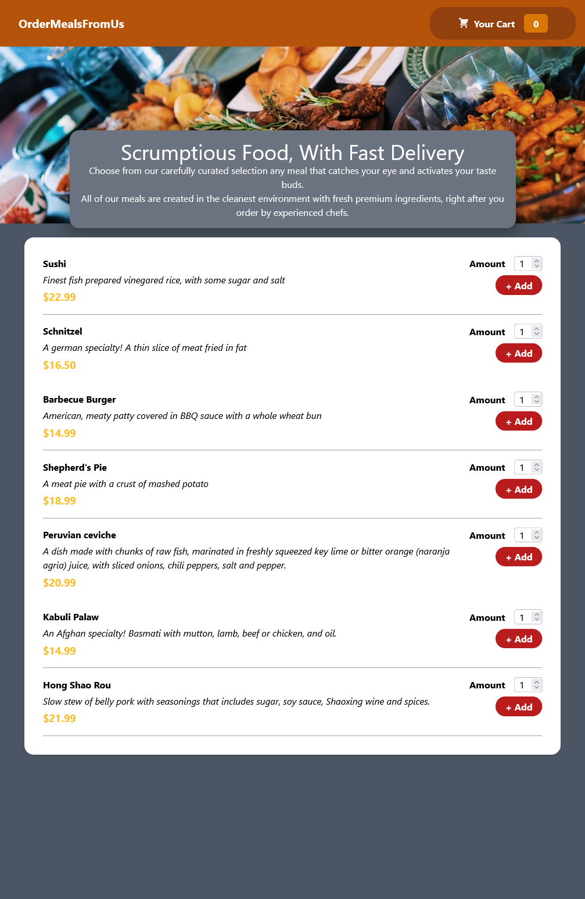
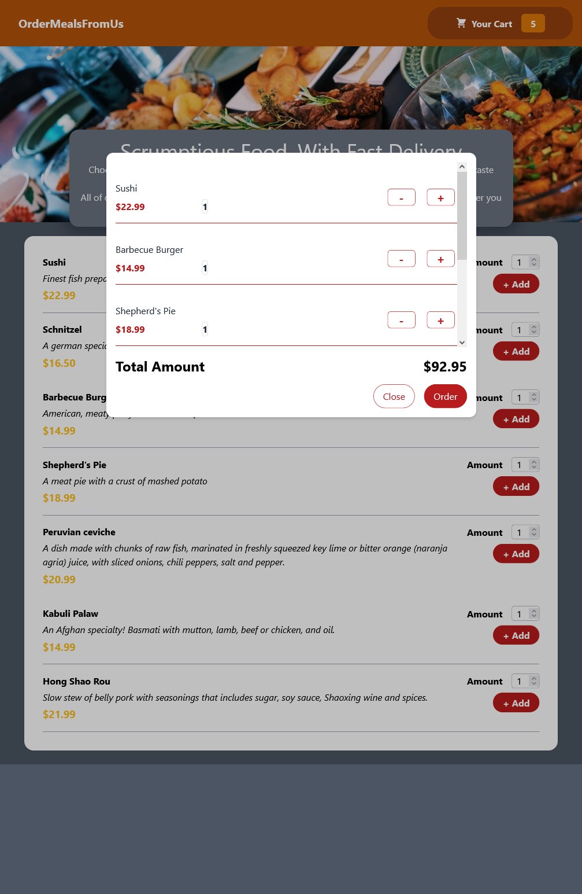
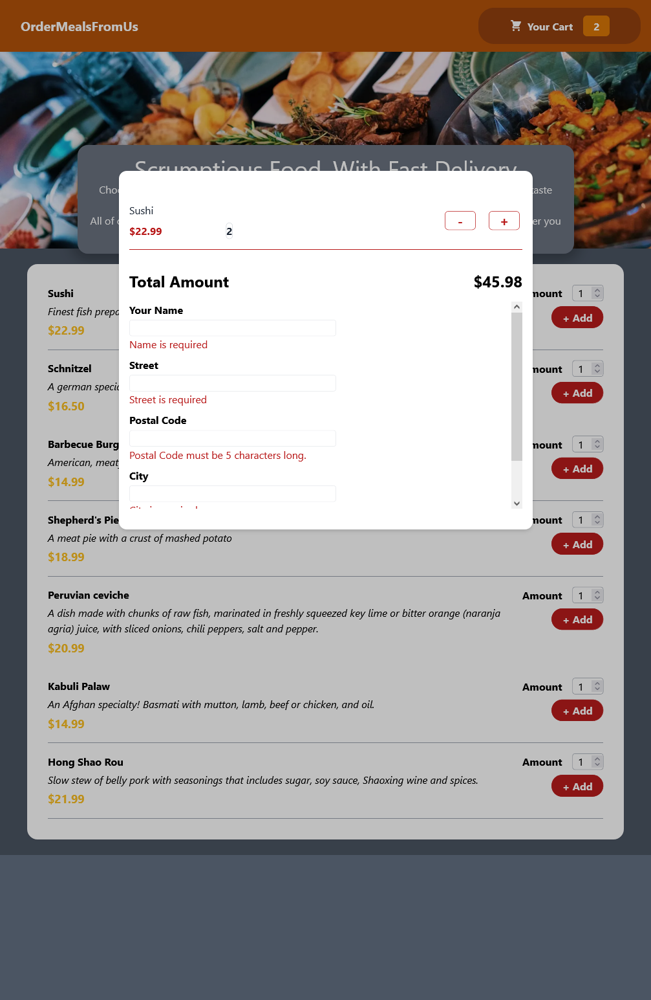
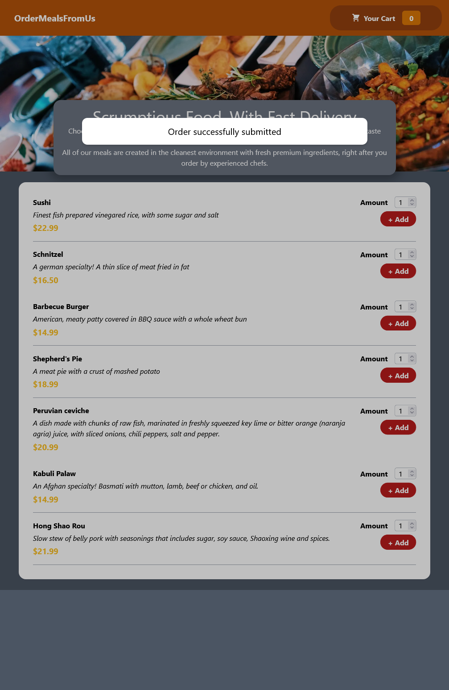
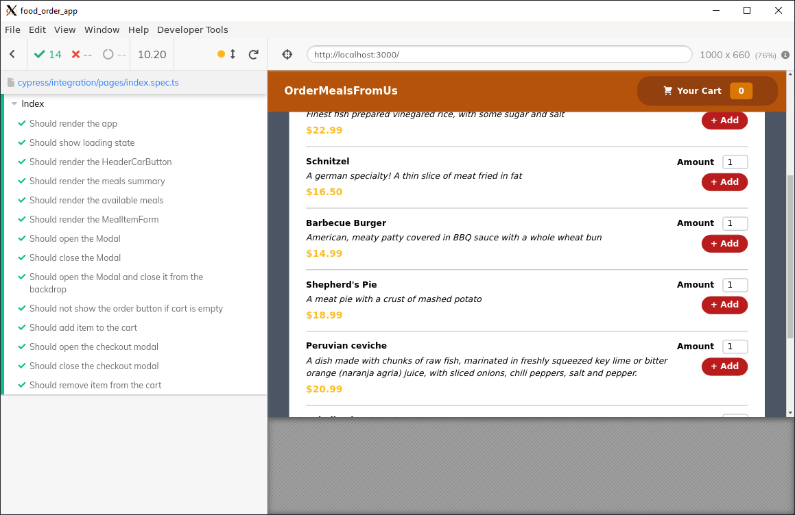

# Food Order App  

This project was motivated by wanting to learn about testing with Cypress and Typescript. I had used Next.js before and decided to go with its take on the React experience.
---

### Screenshots
##### Homepage

##### Order

##### Validation

##### Order Success

##### Cypress

##### Test Coverage


---

### Patterns

* Functional Components

* React Context

* E2E Testing

---

### Technologies

* React.Js

* React Hook Form

* TailwindCSS

* Typescript

* Cypress

---

### Working Example 

[Food Order App](https://z-food-order-app.hellojjwj.com)

---

### Local install

```
git clone https://github.com/JJWJ/food_order_app.git
```


This is a [Next.js](https://nextjs.org/) project bootstrapped with [`create-next-app`](https://github.com/vercel/next.js/tree/canary/packages/create-next-app).

## Getting Started

First, run the development server:

```bash
npm run dev
# or
yarn dev
```

Open [http://localhost:3000](http://localhost:3000) with your browser to see the result.

